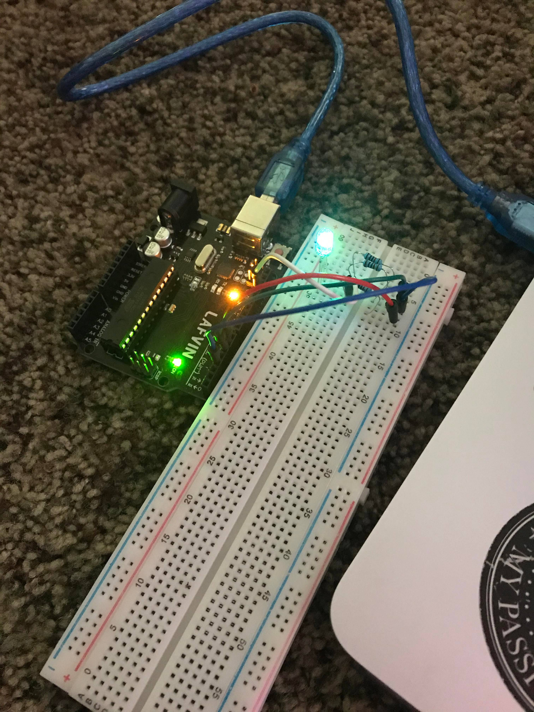
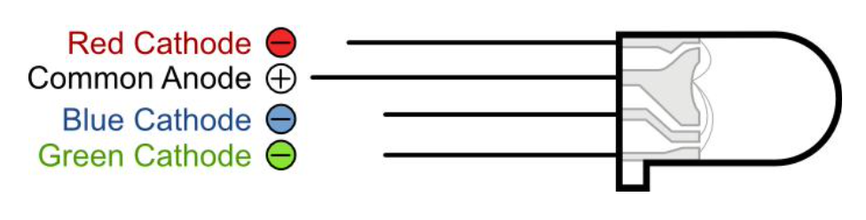
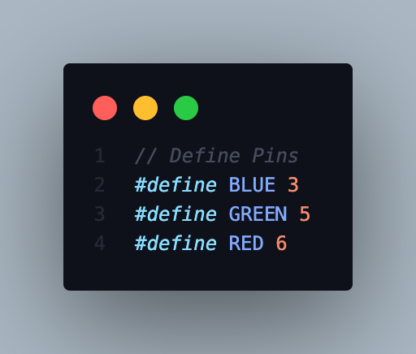
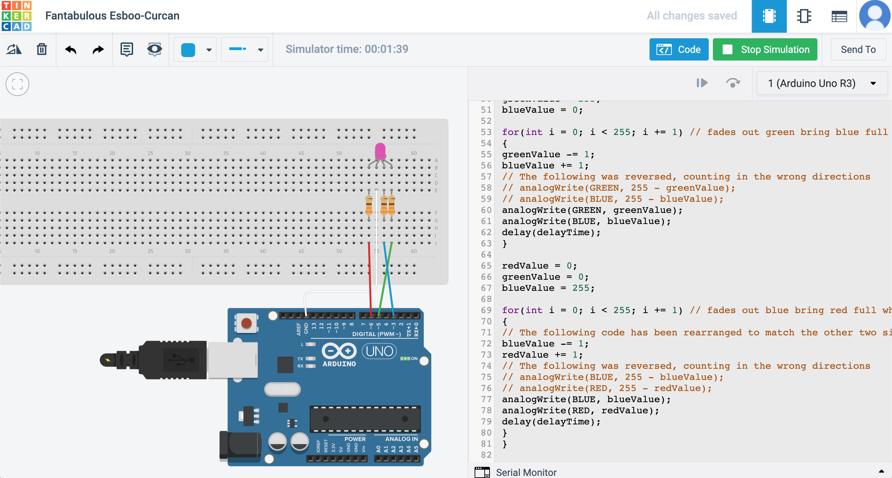
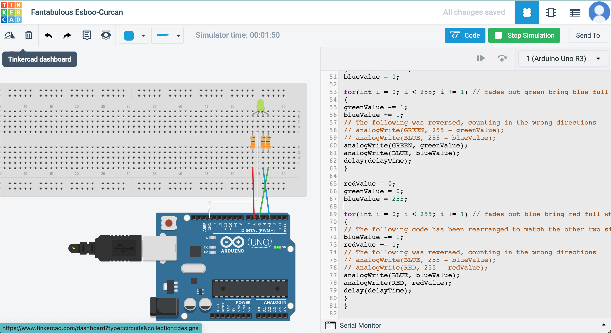

# Final Project - RGB LED

RGB LED lights add color to your projects. RGB LEDs can display any color in the spectrum. In this project, the LED light will start with color **red**, then fade to **green**, then fade to **blue**, and finally back to the **red** color. This will project mos of the color that can be achieved.

**Components Required:**
-
(1) x Uno R3 board
(1) x Breadboard
(4) x Male-to-Male wires
(1) x RGB LED
(3) x 330 ohm resistors

**Wiring Diagram and How it Works**
-

Put the RGB LED light to the breadboard.

Using a male-to-male wire, connect **GND** from Uno R3 board to the **common anode** of the RGB LED light. 

Before connecting the **red**, **blue**, and **green** cathode to their assigned pins, connect a 330 ohm resistor for each pins and the cathodes.

Here is the assignment for the pins.

Upload the code in your Arduino R3. Here is the [code](RGB_LED/RGB_LED.ino) you can copy to paste into your project.

**Arduino Sketch**
-
> Note: Take note of the time and the color of the bulb in each photo

Here is a [video demonstration](https://youtu.be/JpNxU7zz5y8) of the project.
